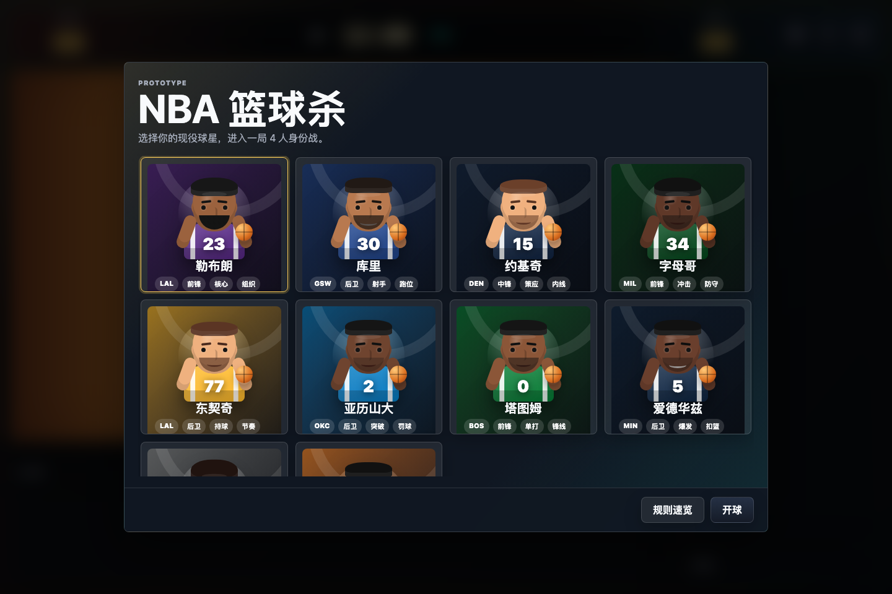
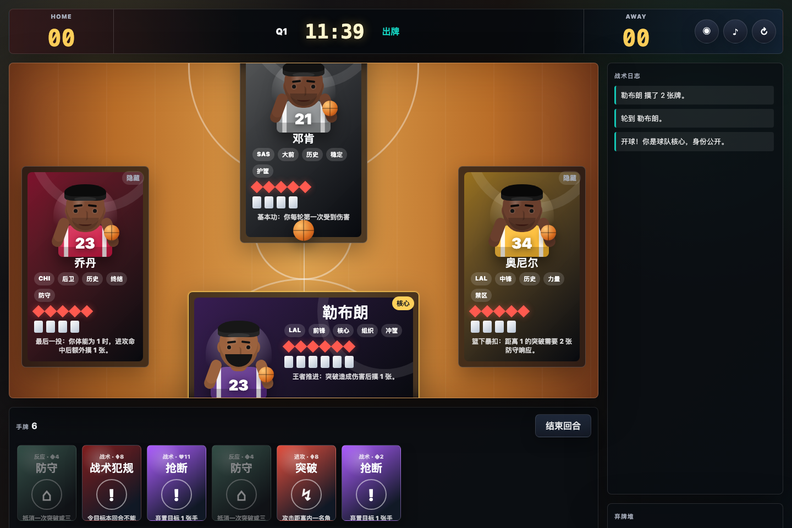
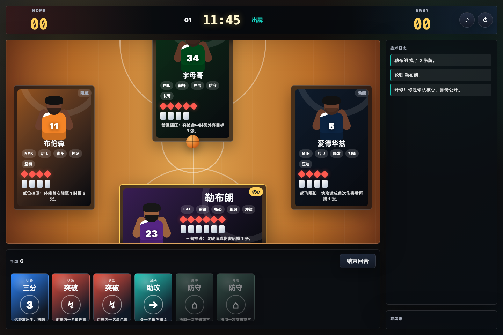

# NBA 篮球杀

一个篮球主题身份卡牌游戏原型。规则参考三国杀的身份局、回合制、手牌、距离、响应链、判定和濒死救援结构，但角色、牌名、技能、音效和场面反馈都改成篮球语境。

当前版本已经包含完整单机 AI 局、4-8 人身份配置、局域网房间、三套人物形象、三档 AI 难度、三档 AI 出牌节奏、五套球场背景、两套增强音效、聊天快捷语、球星专属金色发言、倒计时、手动弃牌、拖拽排序和移动端/iPad 适配。

> 非官方球迷作品，仅用于学习和原型演示。项目不隶属于 NBA、球队或球员本人。

## 快速开始

需要 Node.js。推荐直接用内置服务器启动，这样局域网房间和音频资源都能正常工作：

```bash
npm start
```

启动后终端会输出类似：

```text
NBA Basketball Kill: http://127.0.0.1:4173/
LAN: http://192.168.x.x:4173/
```

本机打开 `127.0.0.1` 地址；同一 Wi-Fi 下的 iPad、手机或其他电脑打开 `LAN` 地址即可加入局域网房间。

基础检查：

```bash
npm run check
```

## GitHub Pages

仓库包含 GitHub Actions 工作流，会在 `main` 分支推送后自动部署静态版：

```text
https://11010tianyi.github.io/nba-basketball-kill/
```

Pages 静态版适合体验单机 AI 局、规则、角色、卡牌和界面适配。局域网房间依赖 `server.mjs` 的 WebSocket 服务，仍需在本机运行 `npm start` 后通过终端输出的 LAN 地址访问。

## 当前内容

- 球星角色：20 名，包括现役、历史级和中国球员
- 卡牌种类：18 种
- 牌堆总数：152 张
- 人数配置：4-8 人身份局
- 游戏模式：单机 AI 局、局域网房间
- 形象模式：拟人球星卡、经典简洁形象、真人现场照片
- AI 设置：新秀、轮换主力、名人堂三档难度；解说、快速、极速三档节奏
- 球场背景：NBA 木地板、复古主场、水泥外场、橡胶训练场、林式涂鸦街球
- 音效模式：球场现场 MP3、街机合成音效，覆盖穿鞋、冠军戒指、护臂、离场、聊天等事件
- 聊天系统：打字、表情快捷语、NBA 球迷文化快捷语、每名球星专属金色发言
- 卡牌视觉：不同功能牌有不同篮球图形背景；支持 `assets/cards/*/` 自定义卡牌背景包
- 操作体验：响应链倒计时、弃牌倒计时、无牌可出快速结束、拖拽排序、一键排序、原因提示、新手规则帮助
- 适配：桌面、iPad 横竖屏、手机布局

## 截图







## 球星池

现役与近现代球星：

- 勒布朗、库里、约基奇、字母哥、东契奇、亚历山大、塔图姆、爱德华兹、文班亚马、布伦森

历史级与中国球员：

- 姚明、乔丹、科比、奥尼尔、艾弗森、邓肯、纳什、易建联、王治郅、郭艾伦

每名球员有体能、位置、标签和专属技能。技能已接入结算，例如库里的三分牵制、姚明的盖帽摸牌、科比的额外进攻、奥尼尔/字母哥的强攻双响应、邓肯的减伤、易建联的三分距离和罚球收益等。

## 身份与胜利

玩家身份：

- 核心：公开身份，核心离场通常会导致核心阵营失败
- 队友：隐藏身份，保护核心并协助清除威胁
- 挑战者：隐藏身份，目标是淘汰核心
- 独狼：隐藏身份，目标是成为最后存活者

人数配置会随 4-8 人自动调整挑战者、队友和独狼数量。核心阵营清除全部挑战者和独狼后获胜；挑战者让核心离场后获胜；独狼需要在残局中单独取胜。

奖惩：

- 淘汰挑战者：击杀者摸 3 张
- 核心误伤队友：核心清空手牌和装备

## 回合流程

1. 准备阶段：刷新本回合技能状态
2. 摸牌阶段：摸 2 张
3. 出牌阶段：使用进攻牌、战术牌、治疗牌、装备牌
4. 响应链：进攻或部分战术牌会要求目标响应
5. 弃牌阶段：手牌数超过当前体能时手动弃牌，战术板可让上限 +1
6. 结束阶段：轮到下一名存活玩家

## 距离系统

距离按场上存活玩家的座位最短距离计算。

- 突破：基础攻击距离 1
- 三分：基础攻击距离 3
- 球鞋：进攻距离 +1
- 护臂：被指定时防守距离 +1
- 挡拆：本回合下一次进攻距离视为无限
- 部分球星技能会调整距离，例如库里、易建联、郭艾伦、塔图姆

目标不在距离内时无法被选择，界面会提示距离原因；AI 出牌同样遵守距离。

## 响应链

进攻响应：

- 突破 / 三分指定目标后，目标可以打出防守或盖帽
- 字母哥、奥尼尔的近筐强攻需要 2 张响应
- 文班亚马每轮第一次受到进攻会自动防守

战术响应：

- 抢断、包夹、战术犯规等敌对战术牌可以被盖帽或教练挑战抵消
- 玩家受到指定时底部出现响应面板，按钮内显示倒计时
- AI 或无牌可响应的玩家会快速跳过，避免无效等待

## AI 难度与节奏

AI 现在分为“节奏”和“难度”两套设置。

节奏：

- 解说节奏：默认模式，AI 每次出牌之间会停顿，并在战术日志里说明决策意图
- 快速节奏：接近原先版本，适合熟悉规则后快速推进
- 极速跳过：保留最早的高速版本，AI 几乎连续结算

难度：

- 新秀：偏随机，会做基础回血、装备和近距离进攻
- 轮换主力：按身份阵营选择目标，队友保护核心，挑战者压核心，独狼削弱强势角色
- 名人堂：更重视胜负目标、低体能集火、拆牌、包夹、战术犯规和队友支援

当前 AI 能读到规则层面的身份与角色定位，用于模拟三国杀式身份局的站队与背刺压力。它还不是完整推理 AI，下一步可以加入“AI 意图图标”和更细的身份怀疑值。

## 判定系统

部分牌会翻开牌堆顶一张作为判定牌。

- 红色：有利结果
- 黑色：普通或失败结果

已接入判定：

- 罚球：红色回复 1 点体能，黑色摸 1 张
- 易建联使用罚球判定为红色时额外摸 1 张

## 卡牌列表

基础 / 进攻：

- 突破：距离内目标需防守，否则失去 1 点体能
- 三分：远距离进攻，被防守后使用者摸 1 张
- 防守：响应突破或三分
- 暂停：回复 1 点体能，也可救濒死角色
- 罚球：进行红黑判定

战术：

- 助攻：令一名角色摸 2 张
- 抢断：弃置目标 1 张手牌或装备
- 盖帽：响应进攻或战术
- 教练挑战：响应并抵消战术牌
- 快攻：连续冲击两个目标
- 包夹：目标弃 2 张，不足则失去体能
- 挡拆：下一次进攻距离无限
- 战术犯规：令目标本回合不能使用进攻牌
- 更衣室鼓舞：你和一名角色各摸 1 张

装备：

- 球鞋：进攻距离 +1
- 护臂：每轮第一次受伤 -1，并提供防守距离
- 战术板：手牌上限 +1
- 冠军戒指：濒死时自动回复 1 点并弃置

## 局域网房间

房间流程：

1. 房主选择人数、球星和“局域网房间”，点击“创建房间”，把房间码发给其他玩家。
2. 其他玩家输入房间码加入后，右下角按钮会变成“准备”；选好自己的球星后点击“准备”。
3. 房主右下角始终是“开球”。所有已加入玩家准备后，房主点击“开球”进入同一局。
4. 房主浏览器作为规则结算端，负责 AI、发牌、倒计时、响应链和状态同步。
5. 其他玩家操作自己的手牌，动作会发送给房主结算并同步回全房间。

联机规则：

- 已开球的房间不允许新玩家中途加入。
- 同一浏览器重复加入同一房间不会重复占人数。
- 每个玩家本机视角都会把自己的角色放在球场下方。
- 局域网联机依赖房主页面保持在线，房主关闭页面会影响本局同步。

## 形象与音效

形象模式：

- `portrait`：拟人卡通球星卡，默认模式
- `classic`：保留早期简洁球衣形象
- `photo`：真人现场照片模式，使用 Wikimedia Commons 的公开图片链接；加载失败会自动回退到拟人卡

指定形象：

```text
http://127.0.0.1:4173/?avatar=portrait
http://127.0.0.1:4173/?avatar=classic
http://127.0.0.1:4173/?avatar=photo
```

音效：

- “球场现场”：本地 MP3 真实音频片段
- “街机合成”：Web Audio 合成音效

球场现场音效来自 UnstuntedSFX 免费 royalty-free 声音库，包括 Basketball Swish、Basketball Bounce、Whistle、Crowd Cheer 和 Crowd Applause。许可说明见 https://unstuntedsfx.net/license

新增音效事件：

- 穿鞋、护臂、战术板、冠军戒指装备
- 冠军戒指触发救命
- 离场 / 终场
- 教练挑战、罚球、聊天、球星专属发言

两套音效都覆盖这些事件：街机模式用 Web Audio 合成，现场模式用本地真实片段组合。

## 聊天与快捷语

右侧新增“球场聊天”：

- 可直接打字
- 可点表情快捷语
- 可点 NBA 球迷文化快捷语
- 当前球星会显示专属金色发言，例如勒布朗、库里、科比、姚明等都有符合个人气质的短句

快捷语参考虎扑等 NBA 社区常见球迷表达、球星名场面和公开语录，默认避免攻击性黑称，保留球场互怼和观赛氛围。

球场：

- `nba-hardwood`：NBA 木地板，默认背景
- `classic-garden`：复古主场木质感
- `concrete-park`：水泥外场
- `rubber-training`：橡胶训练场
- `graffiti-street`：林式涂鸦街球风格

卡牌背景包：

本地服务会自动扫描 `assets/cards/` 下的子文件夹。每个子文件夹就是一个背景包，例如：

```text
assets/cards/cartoon/offense.webp
assets/cards/cartoon/reactive.png
assets/cards/cartoon/tactic.jpg
assets/cards/china/offense.png
assets/cards/dark/equip.webp
```

支持的文件名：

- `offense`：进攻牌
- `reactive`：反应牌
- `tactic`：战术牌
- `heal`：治疗牌
- `equip`：装备牌
- `utility`：其他通用牌

支持 `.png`、`.webp`、`.jpg`、`.jpeg`。缺少某一类图片时，会自动回退到默认 CSS 篮球图形背景。本地模式新增或删除文件夹后重启 `npm start`，进入设置里的“卡牌背景”即可切换。GitHub Pages 部署时会由 Actions 自动生成静态清单，因此把背景包提交到仓库后 Pages 也能识别。

## 调试参数

直接开局：

```text
http://127.0.0.1:4173/?autostart=1
```

指定人数：

```text
http://127.0.0.1:4173/?players=8
```

组合使用：

```text
http://127.0.0.1:4173/?autostart=1&avatar=photo&players=8
```

AI 与球场调试：

```text
http://127.0.0.1:4173/?autostart=1&aiSpeed=broadcast&aiLevel=legend&court=graffiti-street
```

指定卡牌背景包：

```text
http://127.0.0.1:4173/?autostart=1&cardPack=cartoon
```

## 文件结构

- `index.html`：页面结构、弹窗、设置入口
- `styles.css`：球场、卡牌、响应面板、三套人物形象和响应式适配
- `app.js`：角色、牌堆、规则引擎、AI、局域网同步、音效与背景音乐
- `server.mjs`：本地静态服务和局域网房间 WebSocket 服务
- `assets/audio/`：真实球场 MP3 音效
- `assets/cards/`：可选卡牌背景包目录，按子文件夹自动识别
- `scripts/generate-card-packs-manifest.mjs`：为 GitHub Pages 生成静态卡牌背景包清单
- `NOTES.md`：原型历史说明
- `NBA篮球杀_全网高相关性项目清单.md`：同类身份卡牌、数字桌游、体育卡牌与可玩性参考清单
- `卡牌视觉设计语言及规范.md`：卡牌背景、GPT-image-2 生成提示词、音效与聊天文案规范

## 开发说明

这个项目目前是轻量静态前端加 Node 内置服务器，没有构建步骤。

常用命令：

```bash
npm start
npm run check
npm run cards:manifest
```

如果 `4173` 被占用，可以换端口：

```bash
PORT=4174 npm start
```

## 后续可扩展

- 更复杂的 AI 阵营推理
- 球员技能编辑器
- 牌组编辑器和自定义扩展包
- WebRTC 或远程服务器房间
- 完整素材授权清单和公开发布前的商标/肖像风险处理
